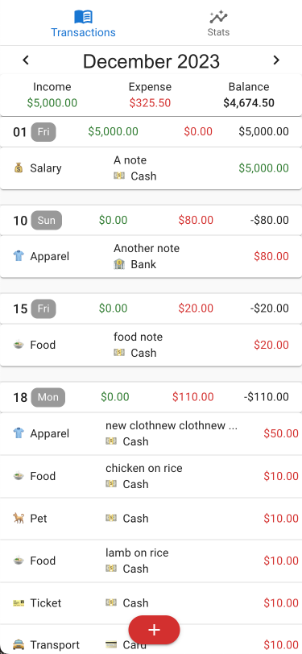
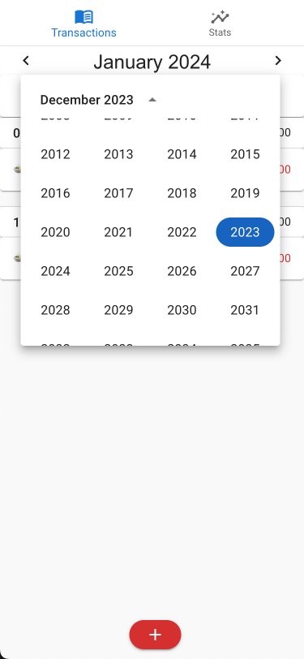
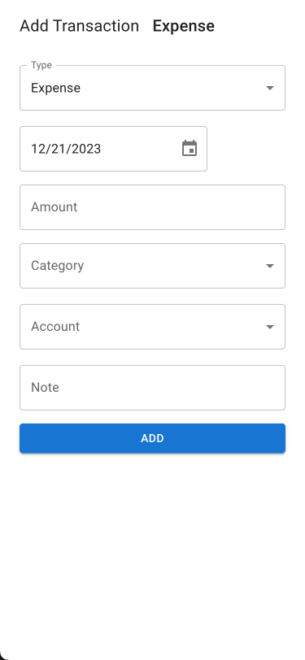
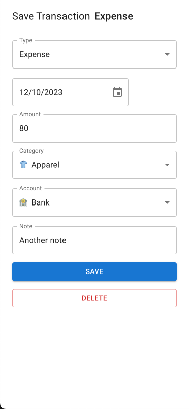
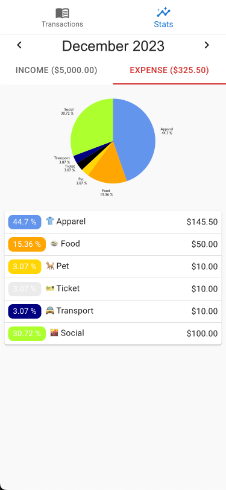

<div align="center">


<b>Wealth Management App</b>
</div>
<p>Take charge of your financial well-being by using our intuitive wealth management app. Say goodbye to the inconvenience of dealing with paper receipts and laborious manual calculations. Our app simplifies the entire process, allowing you to effortlessly monitor and categorize your incomes and expenses. Stay organized, save time, and gain valuable insights into your earnings and spending habits.</p>

## 🛠 Built-with

- ReactJS & Redux Toolkit
- Material UI
- JSON-Server

## 📦 Installation

```bash
npm install
```

## 🚀 Get Started

```bash
npm run start
```

## UI/UX


Moneyvisor                    |  Home Page
:----------------------------:|:---------------------------
  |  


Switch between months                 |  Create a transaction
:--------------------------------------:|:------------------------------------
  |  

Edit/Delete a transaction           |  Stats for a month
:----------------------------------:|:----------------------------
   |  